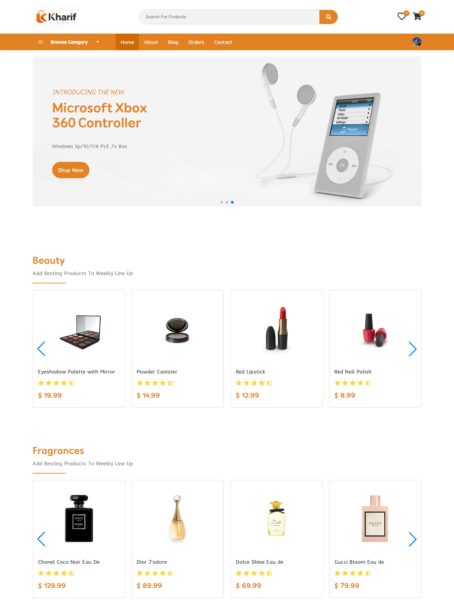
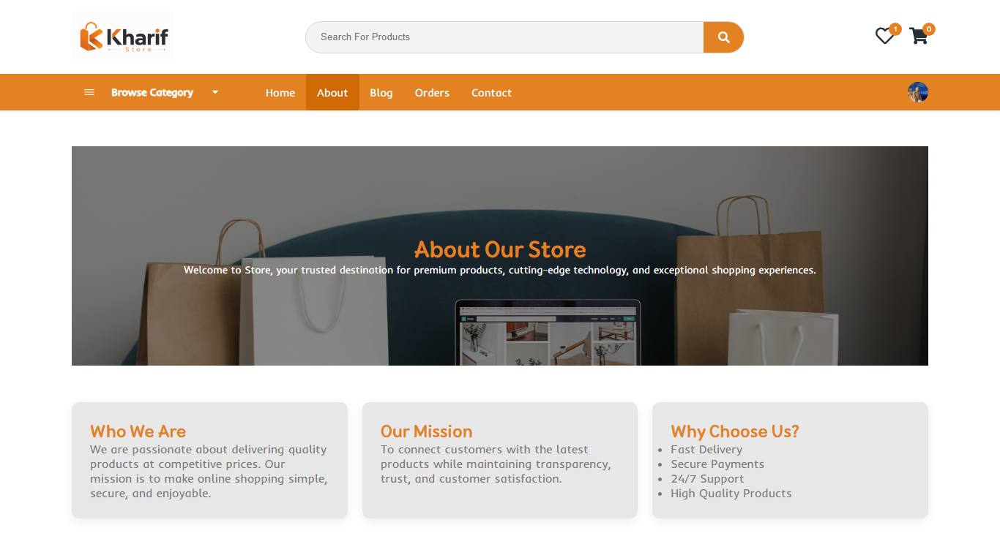
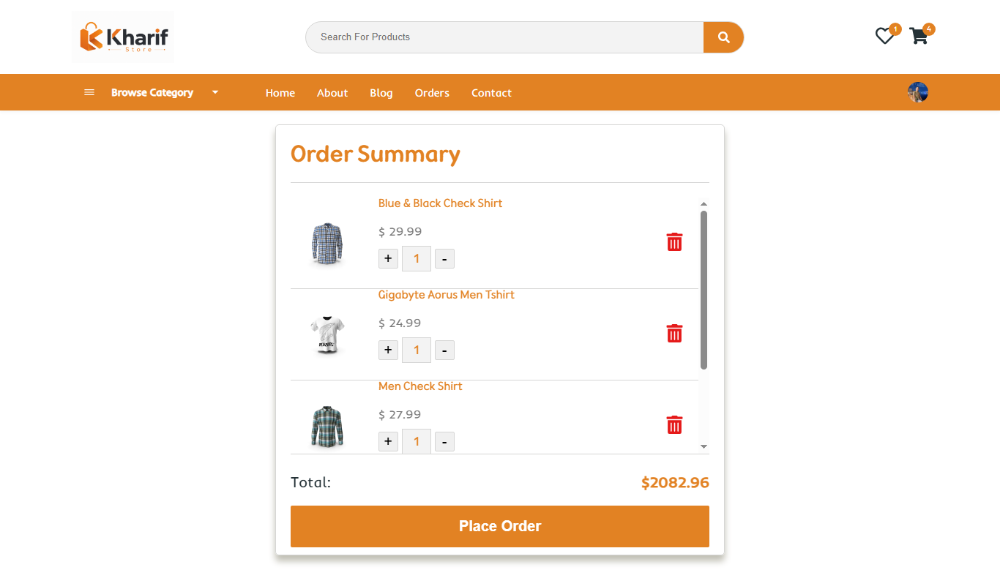
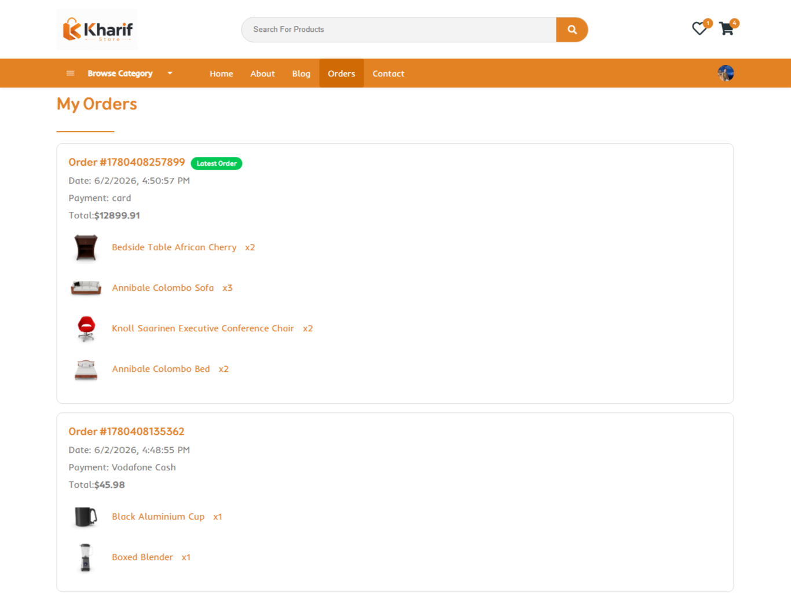
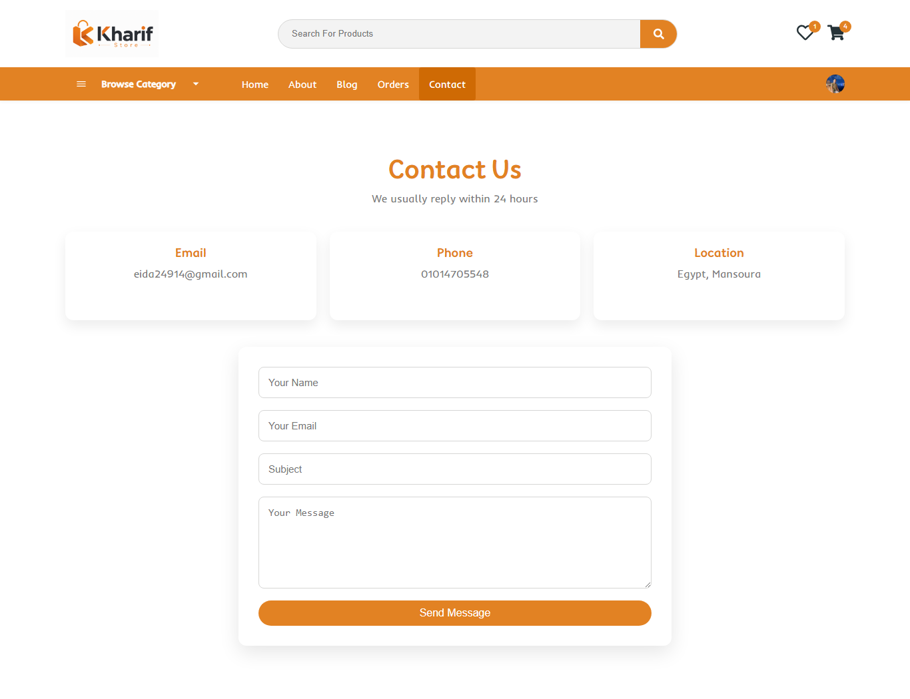
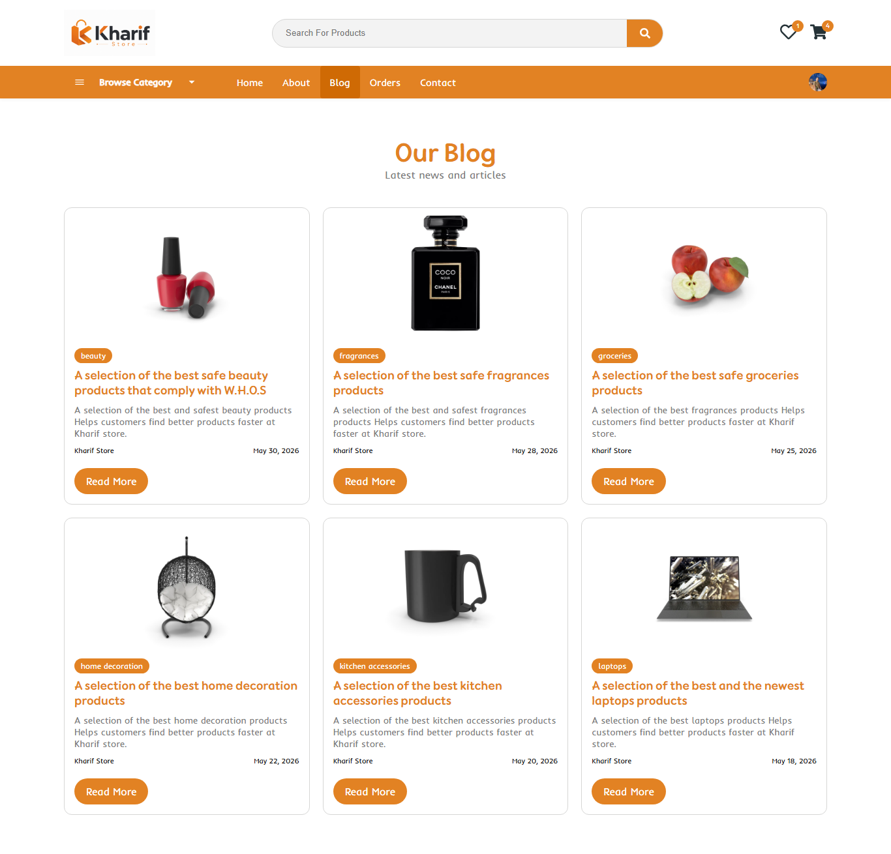
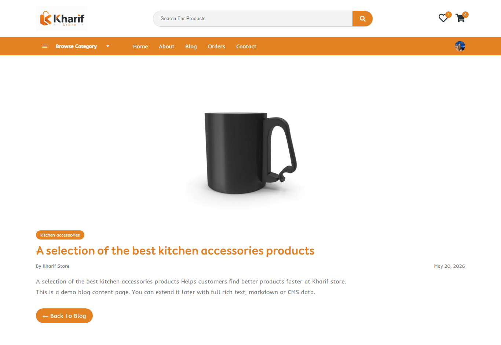
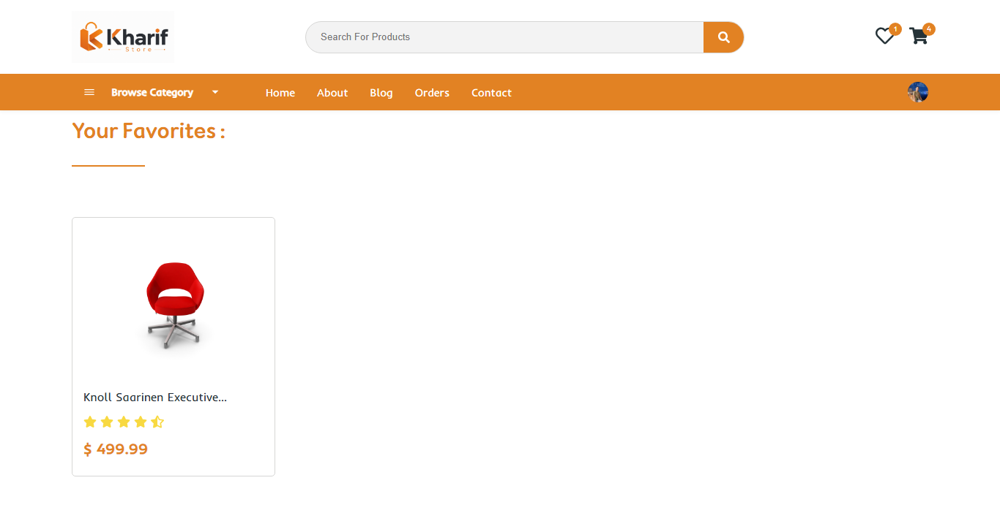

#  Kharif Store

Developed a responsive e-commerce web application using React.js with product browsing, category filtering, search functionality, shopping cart management, favorites system, order tracking, authentication, and contact form integration.

##  Live Demo

 https://kharif-store.netlify.app/

---

##  Features
### User Features

- Browse products
- Product details page
- Add to cart
- Favorites system
- Search products
- Order management
- Blog page
- Blog details page
- Contact page
- Responsive design
- Protected pages with authentication

### Authentication

- Sign Up / Sign In
- Clerk Authentication
- Protected Routes

### Orders

- Place orders
- Select payment method
- Order history
- Latest order badge

---

##  Technologies

- React.js
- React Router DOM
- Context API
- Clerk
- EmailJS
- React Icons
- Axios
-Framer-motion
- Swiper.js
- CSS3

---
## Home Page



## About



## Product Details


## Cart



## Orders



## Contact



## Blog



## BlogDetails



## Fav




##  Installation

Clone the repository

```bash
git clone https://github.com/ahmedeid10/kharifStore.git
```

Go to project folder

```bash
cd kharifStore
```

Install dependencies

```bash
npm install
```

Run project

```bash
npm start
```

---


##  Developed By
Ahmed Eid
X :
https://X.com/ahmedeid_11
GitHub:
https://github.com/ahmedeid10
